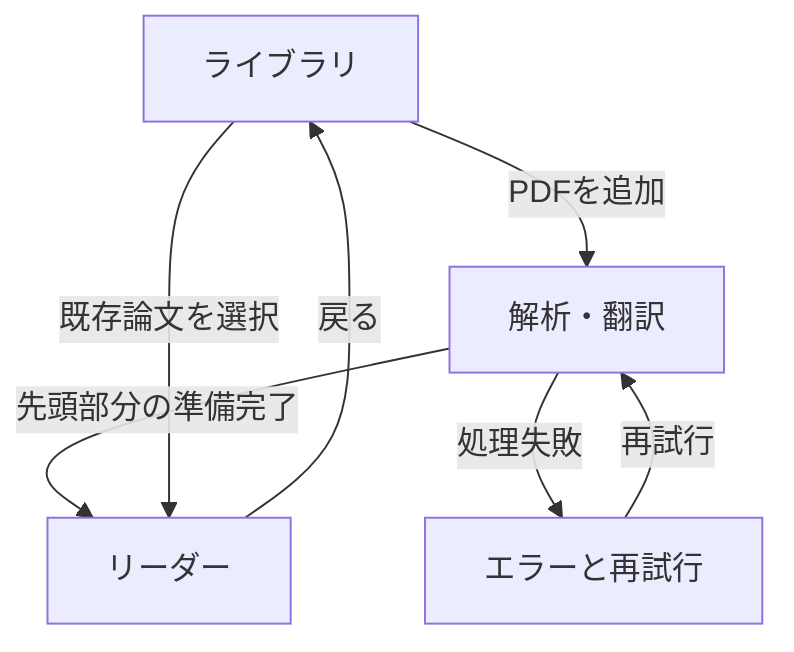

# Paper Reader プロダクト・実装仕様書

> Version 0.1 / 2026-09-02  
> Cursorでの初期開発用仕様書  
> プロダクト名は仮称

## 0. この仕様書の使い方

本書は、英語の学術論文を日本語で読むことに特化したデスクトップアプリ「Paper Reader」の初期開発仕様である。

Cursorには本書をプロジェクトの基準文書として参照させる。実装上の判断が本書と衝突する場合は、本書を優先する。ただし、特定ライブラリや翻訳モデルなどの技術選定は別途決定する。

## 1. プロダクト概要

### 1.1 一文で表すと

英語論文PDFを、日本語のWeb記事を読むような感覚で読める、ローカル動作のデスクトップリーダー。

### 1.2 解決したい問題

既存のPDF翻訳では、次の問題が起こりやすい。

- 2段組や脚注を含むPDFは読む順序が崩れやすい
- 翻訳後の日本語が元論文のどの箇所に対応するか分かりにくい
- 元PDFのレイアウト維持を優先すると、日本語ではかえって読みにくい
- 翻訳が不自然な箇所だけ原文を確かめる操作が面倒
- 論文全体で専門用語の訳語が揺れる
- 翻訳サービスの文字数、料金、アップロード制限に依存する

### 1.3 基本方針

PDFの見た目を忠実に複製するのではなく、論文が持つ意味構造を維持して読書向けに再構成する。

維持する対象：

- 論文タイトル、著者、出版情報
- セクションとサブセクション
- 段落の順序と境界
- 原文段落と翻訳段落の1対1対応
- 図、表、キャプションと本文中の位置関係
- 数式、引用番号、脚注、参考文献
- 元PDF上のページ情報

原則として維持しない対象：

- 2段組などの誌面レイアウト
- フォント、改ページ、余白の忠実な再現
- 日本語訳を元PDFと同じ位置へ流し込むこと

## 2. 対象ユーザーと利用場面

### 2.1 主対象

- 英語論文を全文読みたい大学生・大学院生・研究者
- 英語を精読することより、論文の内容理解を優先したい人
- 翻訳に違和感がある箇所では、すぐ原文を確認したい人
- 論文データを外部サービスへ送らず、ローカルで扱いたい人

### 2.2 代表的な利用フロー

1. アプリをDockまたはFinderから起動する
2. PDFをドラッグ＆ドロップする
3. 解析と翻訳の進行を確認する
4. 翻訳済みの日本語本文を上から読む
5. 違和感のある段落だけ原文を表示する
6. 図表や引用を本文との関係を保ったまま確認する
7. アプリを閉じる
8. 次回起動時、同じ論文の前回位置から再開する

## 3. プロダクト原則

### 3.1 日本語を主役にする

通常状態では翻訳された日本語だけを本文として表示する。英語原文を常時横に並べない。

### 3.2 原文は一操作で確認できる

翻訳の信頼性を担保するため、各段落から対応する原文を即座に開けるようにする。原文確認のために別画面へ遷移させない。

### 3.3 読書中のUIを減らす

常設のAIチャット欄、過剰なツールバー、編集用UIは置かない。主要操作は読書を中断しない位置と表現にする。

### 3.4 処理途中でも読める

論文全体の翻訳完了を待たず、解析・翻訳が完了した先頭部分から読める設計を目指す。

### 3.5 ローカルファースト

PDF、抽出本文、翻訳、読書位置は端末内に保存する。外部APIを必須にしない。ネットワーク接続なしでも、導入済みの翻訳エンジンで基本機能を利用できることを最終目標とする。

## 4. アプリ形態

### 4.1 採用方針

Web技術でUIを実装し、TauriでmacOSデスクトップアプリとして提供する。

ユーザーにlocalhostや開発サーバーを意識させない。完成版は通常の `.app` としてDock、Finder、Spotlightから起動できること。

### 4.2 開発時と配布時

| 状態 | 起動方法 | 目的 |
|---|---|---|
| 開発時 | Cursorから開発コマンドを実行 | 高速なUI実装・検証 |
| 配布時 | Paper Reader.appを起動 | 日常的な読書 |

## 5. 情報設計

### 5.1 主要画面

MVPでは次の3画面に限定する。

1. ライブラリ画面
2. インポート／処理画面
3. リーダー画面

設定は独立した大画面にせず、ライブラリ画面から開く小さな設定画面またはモーダルとする。

### 5.2 画面遷移



## 6. 画面仕様

### 6.1 ライブラリ画面

#### 目的

保存済み論文の再開と、新しい論文の追加を行う。

#### 必須要素

- アプリ名
- PDF追加ボタン
- 画面全体のドラッグ＆ドロップ受付
- 論文一覧
- 各論文のタイトル
- 著者名（取得できる場合）
- 翻訳・解析ステータス
- 最終閲覧日時
- 読書進捗
- 設定への入口

#### 論文カードの状態

| 状態 | 表示 | 主操作 |
|---|---|---|
| 未処理 | 「解析待ち」 | 解析開始 |
| 処理中 | 進捗と現在工程 | 読める範囲を開く／一時停止 |
| 完了 | 読書進捗 | 続きから読む |
| 失敗 | 失敗工程と短い理由 | 再試行 |

#### 初回の空状態

中央に「PDFをここにドロップ」と「PDFを選択」を表示する。機能説明を長く置かない。

### 6.2 インポート／処理画面

#### 目的

ユーザーが待ち時間と失敗箇所を理解できるようにする。

#### 処理工程

1. PDF読み込み
2. テキスト・レイアウト抽出
3. 論文構造の推定
4. 図表・数式・引用の分離
5. 用語集の生成
6. 段落単位の翻訳
7. 読書データの保存

#### 表示要件

- 現在の工程
- 全体のおおよその進捗
- 処理済みセクション
- 「準備できた部分から読む」ボタン
- キャンセル操作
- 失敗時の再試行

モデルのtoken数や内部ログなど、利用者に不要な技術情報は通常表示しない。

### 6.3 リーダー画面

#### 基本レイアウト

- 上部：戻る、論文タイトル、検索、表示設定
- 左：論文アウトライン。必要に応じて閉じられる
- 中央：1カラムの日本語本文
- 右：常設パネルを置かない

本文の最大行幅は読みやすさを優先し、ウィンドウいっぱいに広げない。本文幅、行間、文字サイズはCSS変数等で一元管理する。

#### 本文の表示順

1. タイトル
2. 著者・書誌情報
3. Abstract
4. 本文セクション
5. Acknowledgements等
6. References

元PDFの読み順が明確に抽出できなかった場合、該当箇所に低信頼状態を示し、元PDFを開く導線を出す。

#### アウトライン

- セクションとサブセクションを階層表示する
- 現在読んでいるセクションをハイライトする
- 選択時に該当位置へスクロールする
- 処理中のセクションには処理状態を表示する

#### 段落

各翻訳段落は、対応する原文段落のIDを保持する。段落にホバーまたはフォーカスしたときだけ、控えめな原文表示操作を出す。

原文の初期表示方式は、段落直下へ展開するインライン方式とする。閉じた際にスクロール位置が大きくずれないようにする。

キーボード操作として、Optionキーを押している間だけ現在段落を原文表示する案は実験機能とし、MVP必須にはしない。

#### 図・表

- 本文中の推定位置に元の図表画像を表示する
- 図表自体はMVPでは翻訳しない
- キャプションは日本語訳を表示する
- キャプション原文を展開できる
- 図表をクリックすると拡大表示する
- Figure/Table番号を保持する

#### 数式

- 数式は翻訳対象から除外する
- インライン数式とブロック数式の順序を保持する
- 抽出できない場合は元PDFの該当領域を画像として表示する

#### 引用と参考文献

- `[12]`、`(Author, Year)` 等の引用表現を壊さない
- 構造解析で紐付けできた引用は、Referencesの該当項目へ移動できる
- References自体はMVPでは原則翻訳しない
- 紐付けに自信がない場合は、誤リンクせずプレーンテキストとして表示する

#### 読書位置

- スクロール位置を自動保存する
- 再度開いた際に前回位置から再開する
- 位置はピクセル値だけでなく、セクションID・ブロックID・ブロック内相対位置で保持する

## 7. 翻訳仕様

### 7.1 翻訳単位

基本単位は1段落とする。

翻訳時には、現在段落に加えて前後段落、セクション名、論文用語集を文脈として渡せる設計にする。ただし保存する翻訳結果は現在段落だけとし、原文と翻訳の1対1対応を維持する。

### 7.2 翻訳対象

| 要素 | MVPでの扱い |
|---|---|
| タイトル | 翻訳する。原題も保持 |
| Abstract・本文 | 段落単位で翻訳 |
| 見出し | 翻訳する。原文も保持 |
| 図表キャプション | 翻訳する |
| 図表画像内の文字 | 翻訳しない |
| 数式 | 翻訳しない |
| 引用記号 | 保護して維持 |
| References | 原則翻訳しない |
| ヘッダー・フッター・ページ番号 | 本文から除外 |

### 7.3 用語の一貫性

論文のタイトル、Abstract、キーワード、頻出語から論文固有の用語集を生成する。

用語集の各項目は少なくとも次を持つ。

- 英語表記
- 採用する日本語訳
- 原語を併記するか
- 適用範囲
- ユーザー修正の有無

MVPでは自動用語集の生成と参照を実装対象とし、用語集をユーザーが編集するUIは次段階でもよい。ただしデータ構造は編集可能な形で設計する。

### 7.4 再翻訳

段落単位で再翻訳できる構造にする。翻訳モデルや用語集が変わった場合でも、PDF全体を再処理せず対象段落だけ更新できること。

## 8. PDF構造化仕様

### 8.1 内部表現

PDFをプレーンテキスト1本として扱わず、順序付きブロックへ変換する。

```text
Paper
 ├─ Metadata
 ├─ Section
 │   ├─ Heading
 │   ├─ Paragraph
 │   ├─ Figure
 │   ├─ Table
 │   ├─ Equation
 │   └─ Footnote
 └─ References
```

### 8.2 ブロック共通項目

```ts
type PaperBlock = {
  id: string
  paperId: string
  sectionId: string | null
  type: 'heading' | 'paragraph' | 'figure' | 'table' | 'equation' | 'footnote' | 'reference'
  order: number
  pageStart: number
  pageEnd: number
  boundingBoxes: BoundingBox[]
  original: string | null
  translated: string | null
  extractionConfidence: number | null
  translationStatus: 'pending' | 'processing' | 'completed' | 'failed' | 'skipped'
  parentBlockId: string | null
  metadata: Record<string, unknown>
}
```

この型は概念仕様であり、採用言語やDBに合わせた調整を許可する。ただしID、順序、ページ位置、原文、翻訳、状態の保持は必須とする。

### 8.3 セクション

```ts
type Section = {
  id: string
  paperId: string
  parentSectionId: string | null
  order: number
  level: number
  originalTitle: string
  translatedTitle: string | null
  normalizedKind: 'abstract' | 'introduction' | 'related_work' | 'method' | 'results' | 'discussion' | 'conclusion' | 'references' | 'other'
}
```

`normalizedKind` は推定結果であり、元の見出し文字列を必ず別に保持する。

### 8.4 論文

```ts
type Paper = {
  id: string
  sourceFilePath: string
  sourceFileHash: string
  titleOriginal: string | null
  titleTranslated: string | null
  authors: string[]
  publication: string | null
  year: number | null
  pageCount: number
  processingStatus: 'queued' | 'extracting' | 'structuring' | 'glossary' | 'translating' | 'ready' | 'partial' | 'failed'
  lastReadBlockId: string | null
  lastReadOffset: number | null
  createdAt: string
  updatedAt: string
}
```

同じファイルハッシュのPDFを再投入した場合は重複を通知し、既存データを開く選択肢を優先する。

## 9. 機能要件

### FR-01 PDFの追加

- Finderからのドラッグ＆ドロップに対応する
- ファイル選択ダイアログに対応する
- MVPの入力形式はPDFのみとする
- パスワード保護PDFは処理せず理由を表示する

### FR-02 バックグラウンド処理

- UIを固めずに抽出・翻訳を実行する
- 処理中に別の保存済み論文を読める
- アプリ終了時に未完了状態を保存し、次回再開できる

### FR-03 部分的な読書開始

- Abstractまたは先頭セクションまで翻訳済みになった時点でリーダーを開ける
- 未翻訳箇所には本文の代わりに状態表示を出す
- 読書位置に近い未翻訳段落を優先できる設計にする

### FR-04 原文確認

- すべての翻訳済み段落から対応する原文を表示できる
- 原文と日本語訳を取り違えないようブロックIDで紐付ける
- 原文表示状態は段落ごとに保持する必要はない

### FR-05 検索

- 日本語訳と英語原文の両方を検索対象にする
- 結果にはセクション名と短い前後文脈を表示する
- 結果選択で該当ブロックへ移動する

### FR-06 表示設定

- 文字サイズ
- 行間
- 本文幅
- ライト／ダーク／システム連動

設定は全論文に共通とし、自動保存する。

### FR-07 元PDF参照

- 元PDFを別表示で開ける
- 可能であれば現在ブロックの元ページへ移動する
- 構造抽出に失敗した箇所から元PDFへ戻れる

### FR-08 データ削除

- 論文単位で抽出データと翻訳を削除できる
- 元PDF自体を削除するかはユーザーに明示して選ばせる
- OS上の元PDFをアプリが勝手に削除しない

## 10. 状態とエラー

### 10.1 区別すべき失敗

- PDFを開けない
- テキストを抽出できない
- 読み順を推定できない
- OCRが必要
- 構造推定の一部が低信頼
- 翻訳エンジンを起動できない
- 特定段落だけ翻訳できない
- 保存容量が不足

### 10.2 エラー表示原則

- 「失敗しました」だけで終わらせず、失敗した工程を示す
- 復旧可能なら再試行ボタンを出す
- 一部だけ失敗した場合、論文全体を開けなくしない
- 技術ログは詳細表示またはログ書き出しに分離する
- ユーザーの原本PDFを変更しない

## 11. 非機能要件

### 11.1 プライバシー

- 初期設定では論文データを端末外へ送らない
- 外部API対応を後から追加する場合は、送信対象と送信先を明示し、ユーザーが能動的に有効化する

### 11.2 オフライン

- 初回の必要コンポーネント導入後は、基本的なインポート、翻訳、閲覧をオフラインで完結できることを目標とする
- 外部サービスの無料枠を前提にしない

### 11.3 永続性

- アプリの再起動後も翻訳結果、処理状態、読書位置、表示設定を保持する
- 内部データのバージョンを持ち、将来のスキーマ変更に対応できるようにする

### 11.4 性能

- 100ページ程度のPDFでもUI操作をブロックしない
- 長い論文を一度にDOMへ描画して操作不能にならないよう、必要に応じて遅延描画または仮想化を検討する
- 処理速度そのものより、途中から読めることと進捗が分かることを優先する

### 11.5 アクセシビリティ

- 主要操作をキーボードで行える
- ライト／ダーク両テーマで十分なコントラストを確保する
- アイコンだけの操作にはラベルまたはツールチップを付ける

## 12. MVPの範囲

### 12.1 MVPに含める

- macOSデスクトップアプリとして起動
- PDFの選択とドラッグ＆ドロップ
- デジタル生成された英文PDFのテキスト抽出
- 基本的な2段組の読み順推定
- セクション・見出し・段落の構造化
- 段落単位の英日翻訳
- 日本語1カラム表示
- 段落ごとの原文展開
- 図画像とキャプションの表示
- 数式と引用記号の保護
- アウトライン移動
- 処理進捗と部分的な読書開始
- ローカル保存
- 読書位置の復元
- 日本語／英語検索
- 基本的な表示設定

### 12.2 MVPに含めない

- スキャンPDFの本格OCR
- 図表画像内の文字翻訳
- DeepLのような元レイアウト維持型PDFの書き出し
- Word、EPUB、HTML等の入力
- 注釈、ハイライト、手書きメモ
- AIチャット
- 論文要約、RQ抽出、批判的評価
- クラウド同期
- 複数端末同期
- 共同編集
- Windows版
- App Store配布

## 13. 開発フェーズ

### Phase 0：読書UIプロトタイプ

固定のサンプルデータを使い、リーダー画面だけを作る。

検証すること：

- 1カラム日本語本文の読みやすさ
- アウトラインの必要幅
- 原文のインライン展開
- 図表の配置
- 文字サイズ、行間、本文幅

この段階ではPDF解析と翻訳を接続しない。

### Phase 1：縦切りMVP

1本のデジタル英文PDFを入力し、抽出、構造化、翻訳、表示、再起動後の復元までを通す。

複雑なPDFへの汎用性より、正常系が端から端まで動くことを優先する。

### Phase 2：実用性

- 2段組への対応改善
- 図表・キャプション・引用の対応改善
- 部分的な読書開始
- 検索
- エラー復旧
- 複数論文ライブラリ

### Phase 3：精度と快適性

- 用語集の編集
- 段落再翻訳
- OCR
- Optionキー原文プレビュー等の実験操作
- 翻訳モデルの選択
- 注釈・ハイライトの検討

## 14. MVP受け入れ条件

以下をすべて満たしたとき、MVPを完了とする。

1. ユーザーが開発コマンドを使わず `.app` を起動できる
2. デジタル生成された英語論文PDFをドラッグ＆ドロップできる
3. タイトル、見出し、段落が読み順どおりに1カラム表示される
4. 各本文段落に日本語訳と英語原文が1対1で紐付いている
5. 通常時は日本語だけが表示され、任意の段落の原文を一操作で展開できる
6. 図が本文中に表示され、対応するキャプションが確認できる
7. 数式と引用番号が翻訳処理で欠落・改変されない
8. 翻訳途中でも準備済みセクションを読める
9. アプリを終了・再起動しても処理結果と読書位置が復元される
10. 翻訳または抽出の一部が失敗しても、成功済み部分を読める
11. PDFおよび翻訳データが初期設定で外部へ送信されない

## 15. テスト用PDFの分類

最低限、次の種類で動作確認する。

| 種類 | 確認点 |
|---|---|
| 1カラム・文字中心 | 基本抽出、見出し、段落 |
| 2段組 | 読み順 |
| 図が多い | 図とキャプションの位置 |
| 表が多い | 表の欠落と順序 |
| 数式が多い | 数式保護 |
| 引用が多い | 引用記号とReferences |
| 50〜100ページ | 性能と途中再開 |
| スキャンPDF | 未対応状態の検出と案内 |

同一の少数PDFだけに最適化しない。テストPDFごとに、抽出結果と期待するブロック順序の簡易スナップショットを持つ。

## 16. Cursorへの実装指示

初回の実装では、次の順序を守る。

1. 本書を読み、MVP外の機能を追加しない
2. 既存ファイルと開発環境を確認する
3. Phase 0の固定データ版リーダーを実装する
4. 主要コンポーネントと状態構造を説明する
5. 実行方法とビルド方法をREADMEに記載する
6. 変更後に型検査、lint、テスト、ビルドを実行する
7. 未解決事項や妥協点をREADMEまたはCHANGELOGへ残す

最初のCursor向けプロンプト例：

```text
このプロジェクトでは、Paper_Reader_Product_Spec.mdを最上位の仕様として扱ってください。
まず既存ファイルと実行環境を確認し、仕様書のPhase 0だけを実装してください。
固定のサンプル論文データを用いて、ライブラリ画面からリーダー画面を開き、
日本語1カラム本文、アウトライン、段落ごとの原文インライン展開、図とキャプション、
表示設定を確認できる状態にしてください。

PDF解析、実翻訳、AIチャット、OCRはまだ実装しないでください。
実装前に予定するファイル変更とコンポーネント構成を短く示し、
実装後に起動方法、検証結果、残課題を報告してください。
```

## 17. 未確定事項

以下は実装前またはPhase 1開始前に決める。

- 正式なプロダクト名
- フロントエンドフレームワークと状態管理
- PDF抽出・構造解析方式
- ローカル翻訳エンジンと最低動作メモリ
- Tauri側と翻訳処理側のプロセス構成
- 保存DBと画像キャッシュ形式
- 元PDFを参照するだけか、アプリ管理領域へ複製するか
- モデル等の初回導入体験
- 翻訳処理の中断・再開単位

これらは読書UIを先に検証したうえで決定し、技術上の都合だけで本書のプロダクト原則を変更しない。

## 18. 将来候補

MVP後に利用実態を見て検討する。

- ハイライトとメモ
- 用語集の手動修正
- 選択文の簡単な説明
- 「この文の役割」「前段落との関係」など文脈理解支援
- 参考文献情報の外部リンク
- OCR
- 図中文字のオンデマンド翻訳
- 論文メタデータの自動取得
- 読書メモのMarkdown書き出し
- Windows対応

AI機能を追加する場合も、常設チャット欄を前提にせず、選択箇所に対する短い操作として設計する。

